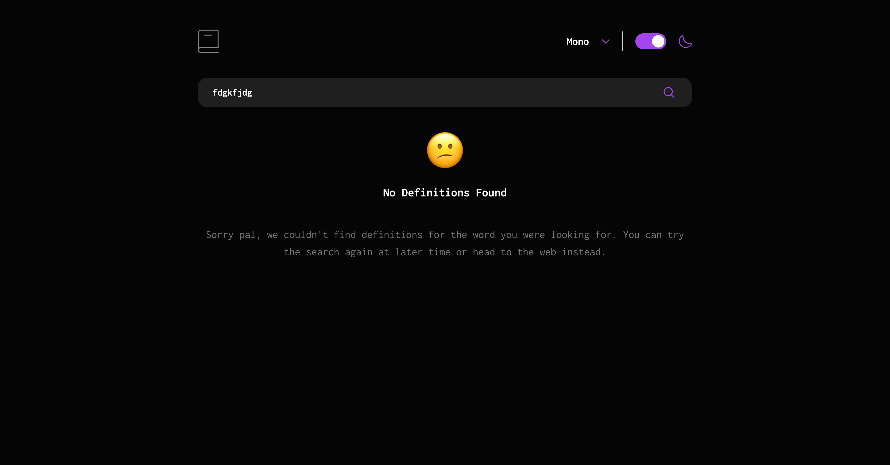

# Frontend Mentor - Dictionary web app solution

This is a solution to the [Dictionary web app challenge on Frontend Mentor](https://www.frontendmentor.io/challenges/dictionary-web-app-h5wwnyuKFL). Frontend Mentor challenges help you improve your coding skills by building realistic projects.

## Table of contents

- [Overview](#overview)
  - [The challenge](#the-challenge)
  - [Screenshot](#screenshot)
  - [Links](#links)
- [My process](#my-process)
  - [Built with](#built-with)
  - [What I learned](#what-i-learned)
- [Author](#author)
- [Acknowledgments](#acknowledgments)

## Overview

### The challenge

Users should be able to:

- Search for words using the input field
- See the Free Dictionary API's (https://dictionaryapi.dev/) response for the searched word
- See a form validation message when trying to submit a blank form
- Play the audio file for a word when it's available
- Switch between serif, sans serif, and monospace fonts
- Switch between light and dark themes
- View the optimal layout for the interface depending on their device's screen size
- See hover and focus states for all interactive elements on the page
- **Bonus**: Have the correct color scheme chosen for them based on their computer preferences. _Hint_: Research `prefers-color-scheme` in CSS.

### Screenshot

Desktop view


Tablet view


Mobile view


Error - word not found


Error - searched word is empty


### Links

- Solution URL: [Github](https://github.com/defydef/dictionary-web-app)
- Live Site URL: [Vercel](https://dictionary-web-app-defydef.vercel.app/)

## My process

### Built with

- Semantic HTML5 markup
- CSS custom properties
- Flexbox
- CSS Grid
- Mobile-first workflow
- [React](https://react.dev/) - JS library
- [Tailwind CSS](https://tailwindcss.com/) - For styles

### What I learned

Implement play audio function to play audio in browser using javascript

```js
function playAudio() {
  const audios = phonetics.filter((p) => p.audio !== "");
  if (audios) {
    const wordAudio = audios[0].audio;
    const audio = wordAudio && new Audio(wordAudio);
    audio.play();
  }
}
```

Set default darkMode preference based on user's device preference (using prefers-color-scheme)

```js
const [darkMode, setDarkMode] = useState(getInitialColorScheme);
// Function to get the initial color scheme based on user preference
function getInitialColorScheme() {
  return window.matchMedia("(prefers-color-scheme: dark)").matches
    ? true
    : false;
}
```

Change darkMode state whenever user is changing the theme (dark or light) on their device, by handling color scheme change inside useEffect

```js
useEffect(() => {
  // Create a MediaQueryList object
  const colorSchemeMediaQuery = window.matchMedia(
    "(prefers-color-scheme: dark)"
  );

  // Attach the event listener for the 'change' event
  colorSchemeMediaQuery.addEventListener("change", handleColorSchemeChange);

  // Call the handler initially to set the initial state
  handleColorSchemeChange(colorSchemeMediaQuery);

  // Clean up the listener when the component unmounts
  return () => {
    colorSchemeMediaQuery.removeEventListener(
      "change",
      handleColorSchemeChange
    );
  };
}, []);
```

## Author

- Frontend Mentor - [@defydef](https://www.frontendmentor.io/profile/defydef)

## Acknowledgments

Thank you Frontend Mentor for providing this challenge 🎉
